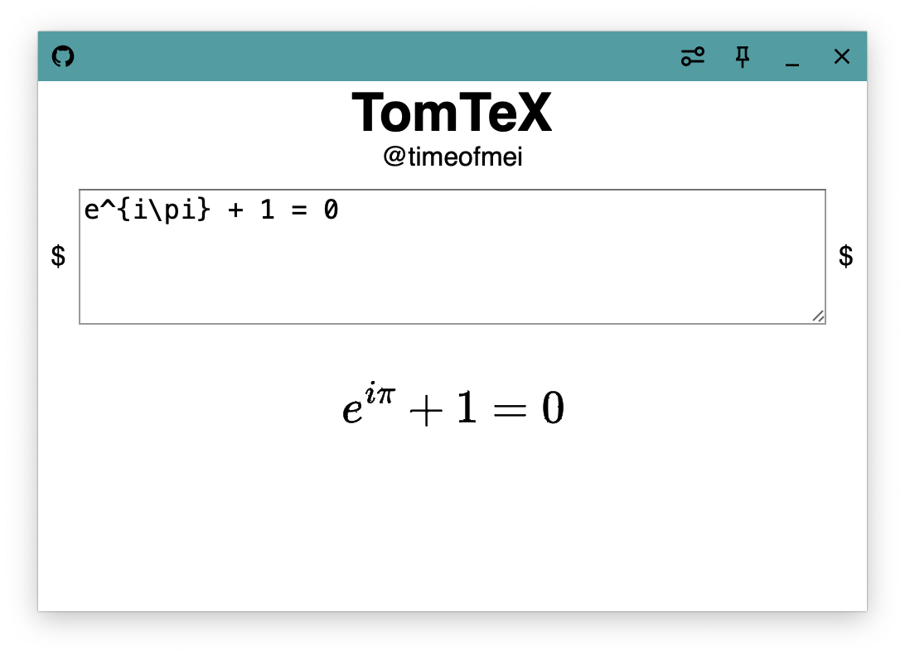

TomTeX
---

a small tool to preview LaTeX math expressions, cross-platform.

## Motivation

I need to take notes on PDF slides given by our professors, but I only have a Mac. Using a mouse or trackpad to draw on the PDF or typing math expressions directly are ugly, so I need LaTeX. For this reason I developed this small tool to take screenshots and insert beautiful LaTeX math expression into PDF slides.

## Download

See the [releases](https://github.com/timeofmei/TomTeX/releases) page.

## Build

1. [Install Rust](https://www.rust-lang.org/tools/install)
2. `cargo install tauri-cli`
3. `git clone && cd TomTeX`
4. `cargo tauri build`

## Tech Stack

- HTML/CSS/Vanilla JS
- MathJax
- Tauri

## TODO

- [ ] Preferences page
- [ ] Background color
- [ ] Text color
- [ ] Window transparency
